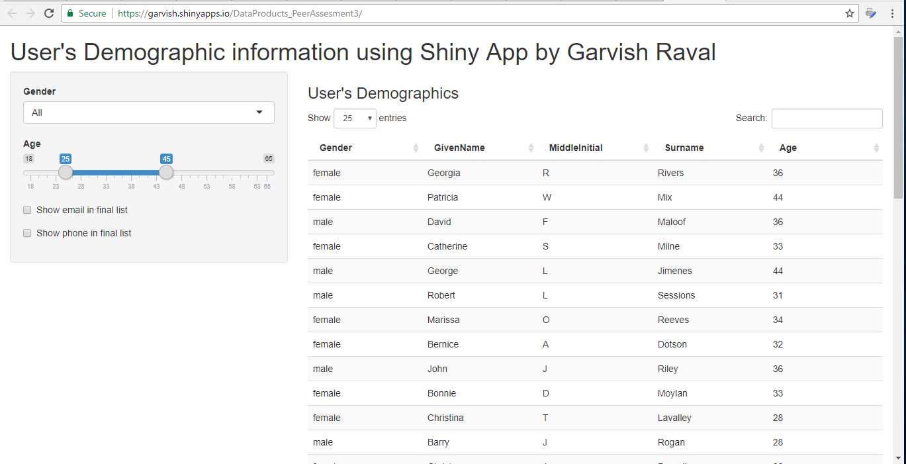

User's Demographic Data  presentation
========================================================
author: Garvish Raval
date: November 13,2017

Introduction
========================================================

This is presentation for User's Demographic, that is part of Course Project for Developing Data Products.

**Agenda**
- Idea
- Data Details
- Data Example
- Summary

Idea
========================================================

The main idea of the application is to provide usefule interface for User's demographic data. It could be use for testing different application where requires relevant user information like name, email, phone, age.

Data Details
========================================================

**Data structure**
- **Gender** - male or female
- **GivenName**	- first name
- **MiddleInitial** - first letter of middle name
- **Surname**	- last name 
- **EmailAddress** - email address
- **TelephoneNumber**	- phone number
- **Age** - person age

Interface provides possbilbity to change Gender and Age range for output result.

Data Example
========================================================

|Gender |GivenName |MiddleInitial |Surname |EmailAddress               |
|:------|:---------|:-------------|:-------|:--------------------------|
|male   |Angelo    |D             |Hunt    |AngeloDHunt@armyspy.com    |
|female |Georgia   |R             |Rivers  |GeorgiaRRivers@dayrep.com  |
|female |Andrea    |T             |Dortch  |AndreaTDortch@dayrep.com   |
|female |Kelly     |W             |Lyman   |KellyWLyman@einrot.com     |
|female |Frances   |M             |Alcorn  |FrancesMAlcorn@dayrep.com  |
|male   |Octavio   |R             |Porter  |OctavioRPorter@armyspy.com |

Summary
========================================================

User's Demographic Presentation Application could be find by link: https://garvish.shinyapps.io/DataProducts_PeerAssesment3/

Application's source code Course Project locates on the GitHub repo: https://github.com/garvish/DataProducts_PeerAssesment3/app

Presentation Pitch's source code Course Project locates on the GitHub repo: https://github.com/garvish/DataProducts_PeerAssesment3/pitch

